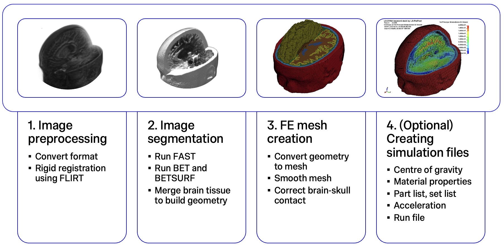
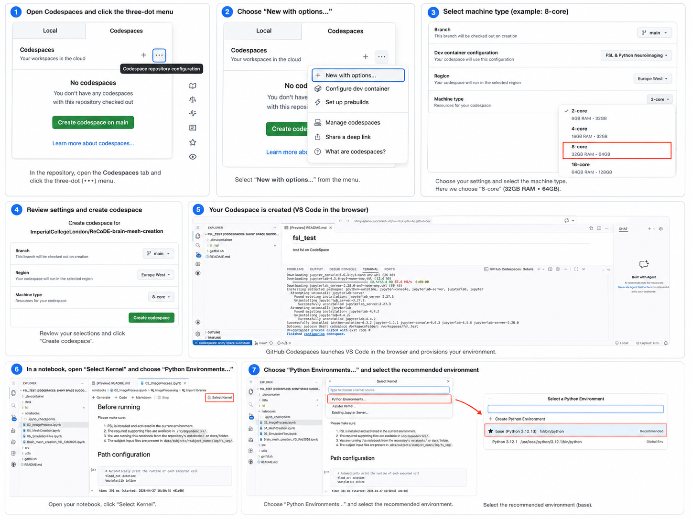

<!--
This README template is designed with dual purpose.

It should help you think about and plan various aspects of your
exemplar. In this regard, the document need not be completed in
a single pass. Some sections will be relatively straightforward
to complete, others may evolve over time.

Once complete, this README will serve as the landing page for
your exemplar, providing learners with an outline of what they
can expect should they engage with the work.

Recall that you are developing a software project and learning
resource at the same time. It is important to keep this in mind
throughout the development and plan accordingly.
-->


<!-- Your exemplar title. Make it sound catchy! -->
# From MRI to Mesh: Finite Element Brain Model Creation

<!-- A brief description of your exemplar, which may include an image -->
This exemplar provides a reproducible workflow for structural magnetic resonance (MR) images to be transformed into a finite element brain mesh in LS-DYNA keyword (`.k`) format. It combines image preprocessing, segmentation and meshing in one clear MRI-to-mesh workflow. It also contains optional post-processing to enable a downstream FE simulations. 


<!-- Author information -->
This brain mesh creation pipeline was scientifically developed by Dr Mazdak Ghajari, Dr Harry Duckworth, Mr Vahid Darvish, and Ms Emily Chan, all in the [HEAD Lab](https://www.imperial.ac.uk/human-experience-analysis-design/) at Imperial College London. 

This exemplar was developed at Imperial College London by Ms Emily Chan in collaboration with Dr Miruna Serina from Research Software Engineering and Dr Jianliang Gao from Research Computing & Data Science at the Early Career Researcher Institute.

With suitable MRI-derived inputs, this pipeline allows users to turn an individual's brain anatomy into a subject-specific finite element mesh.

<!-- Background. Tell learners about why this exemplar is useful. -->
## Disciplinary Background 🔬

In brain biomechanics research, subject-specific anatomical models are often generated from structural MRI data and converted into finite element meshes that can be used to simulate tissue deformation under mechanical loading. These models are widely used traumatic brain injury (TBI) research, where understanding how anatomy influences brain strain can help interpret injury mechanisms and improve predictive modelling. At the [HEAD Lab](https://www.imperial.ac.uk/human-experience-analysis-design/), researchers have used the mesh generation pipeline to generate hundreds of brain FE models, enabling large-scale FE simulations in TBI research, particularly how anatomical differences of the brain affects injury. 


<!-- Learning Outcomes. 
Aim for 3 - 4 points that illustrate what knowledge and
skills will be gained by studying your ReCoDE exemplar. -->
## Learning Outcomes 🎓

After completing this exemplar, you will be able to:

- **Process and visualise neuroimaging data** using FSL, a useful open-source neuroimaging software library. 
- **Interpret the structure of an LS-DYNA mesh file**, understand how nodes, elements, parts, and model definitions. 
- **Generate a subject-specific volumetric finite element brain mesh** from structural MRI-derived inputs.
- (Optional) Understand the basic requirements for **setting up an LS-DYNA simulation**, including the role of supporting files needed alongside the generated mesh.


<!-- Audience. Think broadly as to who will benefit. -->
<!-- ## Target Audience 🎯
This exemplar is aimed at scientists and researchers in biomechanics, biomedical engineering, neurosciences, and computational modelling who want a practical experience in generating subject-specific finite element brain meshes from MR images. 

The generated FE brain mesh, together with the simulation file in the final step, will also enable FE brain simulation that can be applied to traumatic brain injury research. 
 -->

<!-- Requirements-->
## Prerequisites ✅

### Academic 📚

- Basic familiarity with Python, including using libaries and calling functions.
- Basic familiarity with simple Bash commands in Jupyter notebook environment, such as navigating directories, writing shell commands, and handling files (e.g. `cd`, `cp`, `echo`).
- A general awareness of finite element modelling is helpful, but not required.

### System 💻

- Python 3.9 and above
- Jupyter Notebook
- FSL v6.0.7 and above, installed (requires ~20GB disk space) and configured properly
- Sufficient disk space (estimate 2GB) for intermediate image files, and generated meshes
- Ls-PrePost for visualising output brain mesh 

<!-- Software. What languages, libraries, software you use. -->
## Software Tools 🛠️

- Programming language: Python, with some Bash commands used within Jupyter notebooks. 
- [LS-Prepost](https://lsdyna.ansys.com/ls-prepost-2/): a GUI tool for pre- and post-processing of finite element models. 
- [FSL - FMRIB Software Library](https://fsl.fmrib.ox.ac.uk/fsl/docs/install/index.html): a library for brain imaging data analysis. 

  FSL must be correctly configured before running the notebooks. In particular, the `FSLDIR` environment variable must be set, and the FSL command-line tools must be available from your terminal.

  After installing FSL, follow the official [FSL configuration instructions](https://fsl.fmrib.ox.ac.uk/fsl/docs/install/configuration.html). For `bash` or `zsh`, this usually means adding the following lines to your shell configuration file, such as `~/.bashrc`, `~/.bash_profile`, or `~/.zshrc`:

  ```bash
  # FSL Setup
  FSLDIR=~/fsl
  PATH=${FSLDIR}/share/fsl/bin:${PATH}
  export FSLDIR PATH
  . ${FSLDIR}/etc/fslconf/fsl.sh
  ```


<!-- Quick Start Guide. Tell learners how to engage with the exemplar. -->
## Getting Started 🚀

<a href="docs/assets/step-guide.png">
  
</a>

The main step-by-step materials are stored together in `docs/`. This folder contains both the explanatory Markdown pages and the executable notebooks used in the MRI-to-mesh pipeline.

1. Fulfil the [Prerequisites](#prerequisites).
2. Follow `01_Introduction.md` for background information, required inputs, and the expected folder structure.
3. Run `02_ImageProcess.ipynb` to complete image processing and image segmentation.
4. Follow `03_FSLeyes.md` to inspect selected image-processing outputs in FSLeyes and check whether the segmentation worked as expected.
5. Run `04_MeshCreation.ipynb` to generate, smooth, and refine the finite element brain mesh.
6. Follow `05_VisualiseMesh.md` to inspect the generated brain mesh in LS-PrePost by rotating, slicing, and checking the model geometry.
7. Optional: follow `06_Simulation.md` to prepare supporting files for downstream finite element simulation.

Apart from running the notebooks in your local environment, they can also be run directly in GitHub Codespaces using the instructions in [Try code on GitHub with Codespaces](#try-code-on-github-with-codespaces).

### Try the notebooks on GitHub Codespaces

You can run the notebooks directly in GitHub Codespaces without setting up the environment locally. The steps are shown in the image below.

1. In the repository, click the green Code* button, open the *Codespaces* tab, and click the three-dot menu *...*.
2. Select *New with options...* from the menu.
3. Under *Machine type*, choose *8-core, 32 GB RAM, 64 GB storage* or higher (this requires signing up to [GitHub Student Developer Pack](https://education.github.com/pack) if you have not already done so).
4. Review the selected settings, then click *Create codespace*.
5. Wait for GitHub Codespaces to launch VS Code in the browser and finish configuring the environment.
6. Open the notebook you want to run from the `notebooks/`. Click *Select Kernel*, then choose *Python Environments...*.
7. Select the *Recommended* Python environment, for example the `base` environment, to run the notebook. 

<p align="center">
  <a href="docs/assets/codespaces-collage.png">
    
  </a>
</p>


### View neuroimages in Codespaces

There are two options available to view neuroimages.

- Option1 (maybe slow) : Use Trame to view images
  - Find trame_nii_viewer.py and modify the line (16) `/workspaces/ReCoDE-brain-mesh-creation/data/subjects/avg-male/tmp` to the imaging files directory you want to view. Then save the updated trame_nii_viewer.py.
  - in a Codespace terminal, run the following command
  ```
  fslpython trame_nii_viewer.py
  ```
  A new tab will be opened on your web browser to view images. (**be aware**: if it is slow to load images, please refresh the Trame viewer tab)
  
- Option2 (fast): Use `fsleyes render` command to view images
  - In Codespace terminal, run the following command
  
  ```
  fsleyes render --outfile output_T1.png data/subjects/sub0045/img/fs_seg/T1.nii.gz -cm brain_colours_nih
  ```
  
  
    - Modify the output filename `output_T1.png` as needed. This will be the exported PNG image.
    - Modify the input file path `data/subjects/sub0045/img/fs_seg/T1.nii.gz`i f you want to render another NIfTI file.
    - Modify `-cm brain_colours_nih` if you want to use a different colourmap. More colourmap codes can be found at [fsleyes command](https://open.oxcin.ox.ac.uk/pages/fsl/fsleyes/fsleyes/userdoc/command_line.html)
      

<!-- Repository structure. Explain how your code is structured. -->
## Project Structure 🗂️

```
.
├── data/                              # Input data, intermediate files, and generated outputs
│   └── subjects/
│       ├── sub0045/                   # Clean example subject for users to run through the workflow
│       │   └── img/
│       │       └── fs_seg/            # FreeSurfer-derived segmentation inputs
│       │           ├── T1.nii.gz      # T1-weighted structural MRI, used as input
│       │           ├── aseg.nii.gz    # Automated segmentation label map derived from the T1 image
│       │           └── brain.nii.gz   # Skull-stripped T1 volume containing brain tissue only
│       │
│       └── sub0045_example/           # Completed example subject with intermediate and final outputs
│           ├── img/
│           │   └── fs_seg/            # FreeSurfer-derived segmentation inputs
│           │       ├── T1.nii.gz
│           │       ├── aseg.nii.gz
│           │       └── brain.nii.gz
│           ├── bet/                   # Example BET outputs
│           ├── fast/                  # Example FAST outputs
│           └── output/                # Example generated brain mesh and supporting files
│ 
├── docs/                              # Markdown documentation and visual guides
│   ├── 01_Introduction.md             # Background, inputs, and preprocessing overview
│   ├── 02_ImageProcess.ipynb          # Code for MRI preprocessing and image segmentation workflow
│   ├── 03_FSLeyes.md                  # Guide for inspecting image-processing outputs
│   ├── 04_MeshCreation.ipynb          # Code for Mesh generation, smoothing, and refinement workflow
│   ├── 05_VisualiseMesh.md            # Guide for inspecting generated mesh outputs
│   ├── 06_Simulation.md               # Notes on preparing meshes for FE simulation
│   └── assets/                        # Images and media used in the documentation
│
├── src/                               # Source code and supporting tools used by the workflow
│   ├── brain_mesh_creation/           # Python package for mesh-generation utilities
│   │   ├── __init__.py
│   │   ├── mesh_utils.py              # Python utilities for mesh processing and refinement
│   │   └── bmctk.py                   # Script/module for brain mesh creation
│   └── dependencies/                  # Non-Python supporting files required by the workflow
│       └── rs/
│           ├── a.out                  # Executable for mesh smoothing
│           ├── look_up_table.txt      # Lookup table used during mesh creation
│           └── material_properties.k  # FE material property file for the brain model
│ 
├── tests/                             # Reserved for future validation and test scripts
├── mkdocs.yml                         # Configuration file for MkDocs
├── pyproject.toml                     # Project metadata and dependency configuration
├── requirements.txt                   # Optional pinned dependencies for local setup
├── LICENSE.md                         # Project license
└── README.md                          # This file; project overview and usage instructions
```
The repository includes two versions of the subject. The workflow notebooks are set up to run on `sub0045` by default. The `sub0045_example` folder is provided for reference and comparison. You should use the `sub0045` folder when following the notebooks.


<!-- Roadmap.
Identify the project core (a minimal working example). This
is what you should develop first, ideally by week 6. Defining
a core helps ensure that, despite a tight timeline, we will end
up with a complete project.

Identify project extensions. These are additional features that
you will implement after the core of the project is finished; you
could also propose extensions as open-ended exercises for the ReCoDE
audience.

Outline the process of creating the exemplar as a project roadmap
with individual steps. This will help you with defining the scope of 
the project. When you think about this, imagine that you are explaining
it to a new PhD student. Assume that this student is from a related (but
not necessarily same) discipline. They can code but have never undertaken
a larger project. The steps should follow logical development of the
project and good practice. Each will be relatively independent and contain
its own learning annotation and links to other learning materials if
appropriate. The learning annotation is going to form a significant portion
of your efforts.

Learning annotations will evolve as we go along but planning now will be useful
in defining your exemplar steps. Remember that active learning is generally more
valuable than just reading information, so small exercises that build on previous
steps can really help your students to understand the software development process.
You can include videos, text, charts, images, flowcharts, storyboards, or anything
creative that you may think of.

Completed tasks are marked with an x between the square brackets.
-->
## Roadmap 🗺️

### Core 🧩

- [ ] Install prerequisites and setup environment
    * [ ] FSL installation
    * [ ] LS-Prepost installation
- [ ] Image processing and segmentation
    * [ ] Does the *FAST* segmentation produce reasonable result? 
    * [ ] Does the *BET* segmentation produce reasonable result? 
    * [ ] Is the generated geometry file `pre_model.nii.gz` look reasonable in FSLeyes? 
- [ ] Mesh creation and smoothing
    * [ ] Does the generated mesh look reasonable in LS-PrePost? 

### Extensions 🔌

(Requires deeper understanding of finite element analysis) 

- [ ] Understand the supporting files for FE simulations using the generated mesh
    * [ ] Material property of the brain 
    * [ ] Centre of gravity of the brain
    * [ ] Parts and sets of the brain model
    * [ ] Acceleration, the mechanical loading apply to the brain model
    * [ ] Run file, the configuration of FE simulation


<!-- Best practice notes. -->
## Best Practice Notes 📝

- During image processing and segmentation steps, regularly check the intermediate outputs using [FSLeyes](https://open.oxcin.ox.ac.uk/pages/fsl/fsleyes/fsleyes/userdoc/install.html) if you are running the project locally, or follow [this](#view-neuroimages-in-codespaces) if you are using with Codespaces. 

<!-- Estimate the time it will take for a learner to progress through the exemplar. -->
## Estimated Time ⏳

| Task                      | Estimated time |
|---------------------------|----------------|
| Introduction              | 10 min         |
| Environment setup         | 30 min         |
| Image processing          | 1 hour         |
| Image visualisation       | 1 hour         |
| Mesh creation             | 1 hour         |
| Mesh visualisation        | 1 hour         |
| Extension                 | 30 min         |
| **Total Estimated Time**  | **5 hours**    |


<!-- Any references, or other resources. -->
<!-- ## Additional Resources 🔗

- Placeholder when our paper has a preprint -->

## Licence 📄

This project is licensed under the [BSD-3-Clause license](LICENSE.md).
