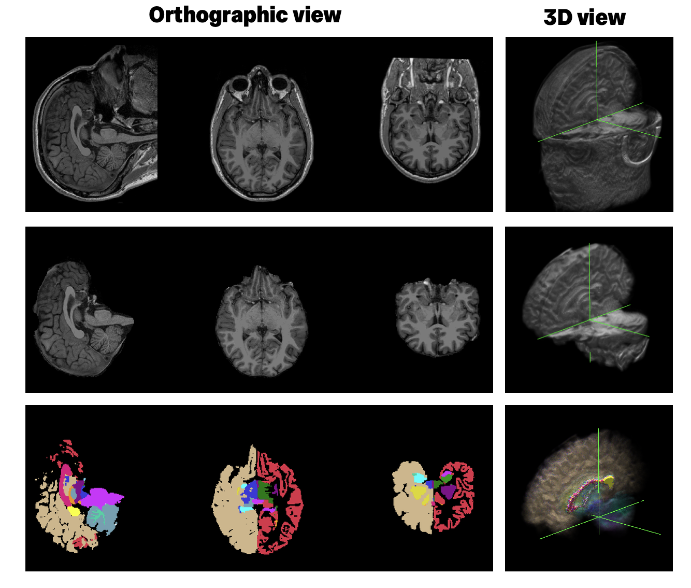

# Introduction

Finite element (FE) methods can be used to simulate how structures deform under loading. In brain biomechanics, brain FE models are useful because they allow us to estimate brain deformation in situations where direct measurement is difficult or impossible. To do this, we first need a geometric representation of the brain that can be discretised into elements for computation.

Because brain anatomy varies between individuals, a single generic brain geometry cannot fully represent the population. Subject-specific brain FE meshes are therefore important, as they better capture anatomical differences between individuals and provide a more realistic basis for later simulation.

In this project, we go through the full pipeline for turning a brain scan into a subject-specific finite element (FE) mesh. Using a sample scan from a healthy subject, you will see how raw imaging data can be processed into a mesh that captures the shape of an individual brain. Once you understand the workflow, the same approach can be applied to other brain scans too — in other words, it can be used to generate a brain FE mesh for any subject with the right imaging input. The final output of this project is the FE mesh itself, which describes the brain geometry in a form ready for numerical analysis. To turn this mesh into a complete FE model for simulation, the mesh would need to be combined with additional files such as material properties, boundary conditions, and loading definitions.

## Basic brain structure

__TODO__

## Magnetic resonance imaging

The starting point of this project is a **magnetic resonance imaging (MRI) scan** of the brain. MRI is a widely used way of imaging soft tissues inside the body, and it is especially useful for the brain because it can show anatomical detail much more clearly than many other imaging methods. Instead of looking at function or activity, here we are interested in structural MRI, which shows the shape and internal structure of the brain.

In this project, the main scan type is a **T1-weighted MRI**. This is one of the most common structural brain scans used in both hospitals and research. It gives a clear view of brain anatomy and provides good contrast between different tissues, which makes it a strong starting point for image processing and mesh generation.

However, the scan straight from the scanner is only the beginning. Before it can be used to generate an FE mesh, it needs to be processed so that the brain can be separated from surrounding tissues and different anatomical regions can be identified more clearly.

## Preparing input image

T1-weighted image is processed generated by FreeSurfer *recon-all*, an automated process for structural brain MRI analysis. The *recon-all* performs a sequence of cortical reconstruction steps including intensity normalisation, skull stripping, and subcortical segmentation, and it produces a large set of outputs for different stages of brain image processing, including skull-stripped images, tissue segmentations, surface reconstructions, anatomical labels, and other intermediate files. 

Three FreeSurfer outputs are used in this workflow: `T1.mgz`, `brain.mgz`, and `aseg.mgz`.

- `T1.mgz` is the processed T1-weighted structural image. In FreeSurfer, this file is the intensity-normalised version of the input anatomical scan and serves as the main reference image for later steps.
- `brain.mgz` is the brain-extracted image. It keeps the brain while removing non-brain tissues, making later processing easier to focus on the anatomy of interest. In the standard FreeSurfer stream, skull stripping produces the brain mask volumes used for this purpose.
- `aseg.mgz` is the automated segmentation file. It contains labels for major anatomical regions and tissue classes, providing structural information that is useful for downstream processing.

We do not run *recon-all* as part of this project for two reasons. First, it is a fully automated preprocessing step, so there is not much to demonstrate once the input scan has been given to the software. Second, it can take a long time to complete for one subject, usually a few hours (sometimes up to 40 hours!). To keep this project focused and practical, we start from pre-generated FreeSurfer outputs and use them directly in this mesh-generation pipeline. 

As an initial step, these files are converted from the MGZ format to NIfTI (`.nii.gz`) format using FreeSurfer’s `mri_convert` tool. NIfTI is a common neuroimaging file format and is easier to use in the processing steps that follow.

## Further reading
- Guidance for running recon-all from raw MRI data is available in the official [FreeSurfer documentation](https://surfer.nmr.mgh.harvard.edu/fswiki/recon-all).
- [FreeSurfer Short Course](https://andysbrainbook.readthedocs.io/en/latest/FreeSurfer/FreeSurfer_Introduction.html) by Andy's Brain Book. 

