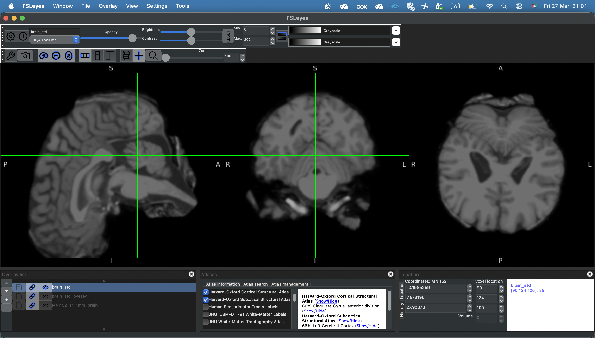
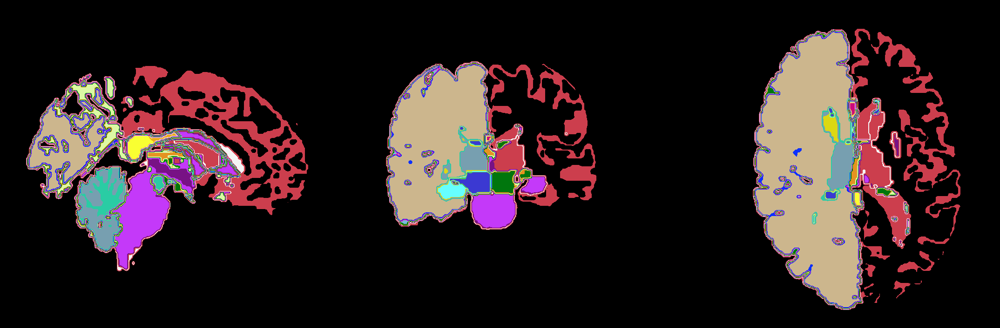
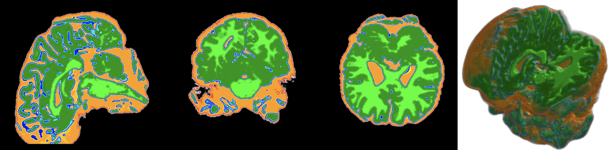
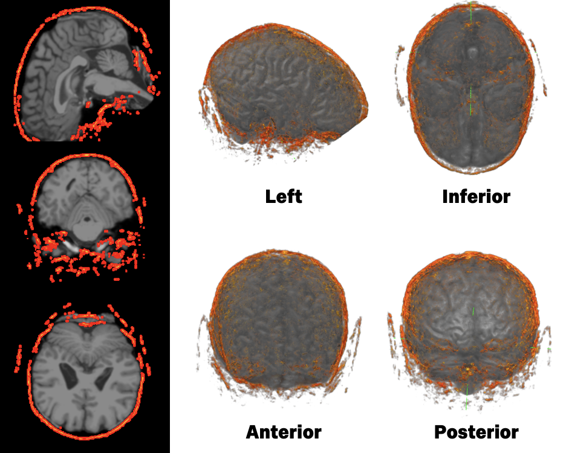
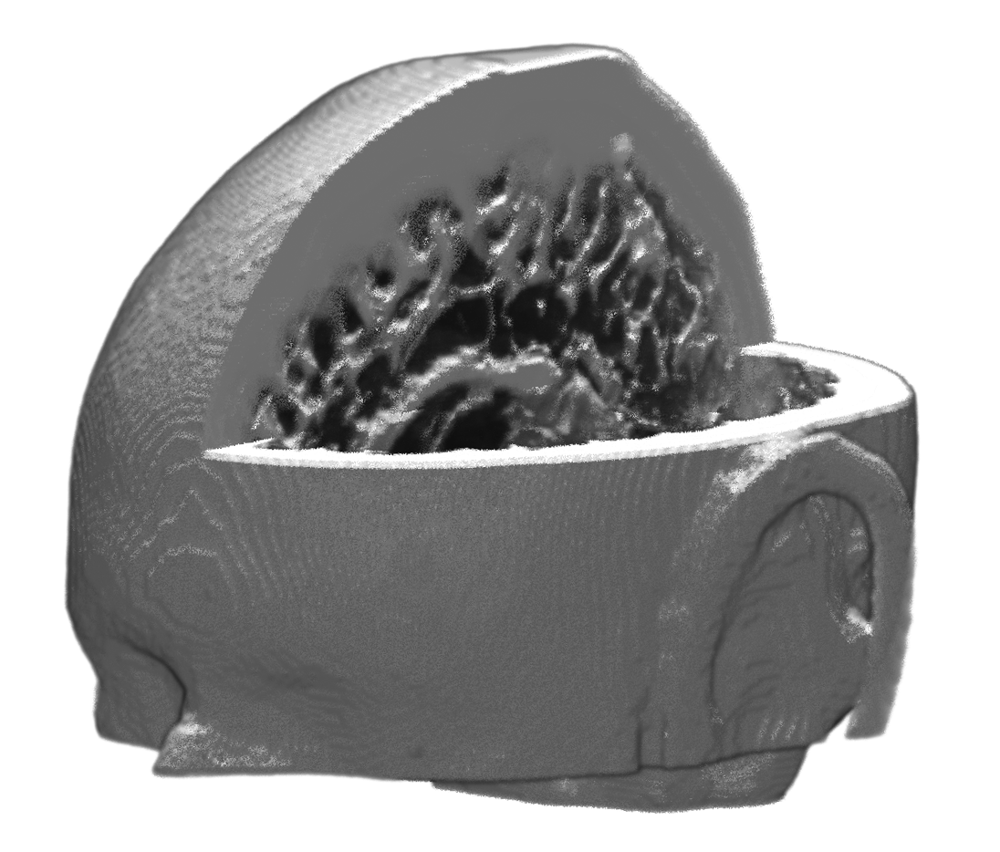
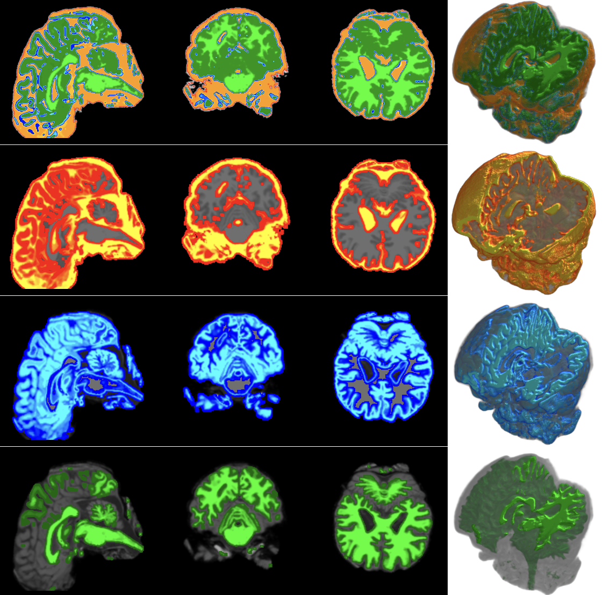

# Hands-on: View neuroimages with FSLeyes

In `02_ImageProcess.ipynb`, we generated a series of intermediate NIfTI outputs. In this page, we use **FSLeyes** to inspect these outputs visually. The goal is not only to become familiar with the software interface, but also to understand what each processing step has produced and to check that the final brain geometry is suitable for downstream FE mesh generation.

## Using FSLeyes

### A quick tour of the FSLeyes interface

FSLeyes can be used either from the command line or through its graphical interface. In this exercise, we use the graphical interface to inspect the outputs from FSL segmentations. Before examining those images, it is helpful to become familiar with the small set of controls that will be used repeatedly throughout this page.

_TODO annotate the image_

The most useful parts of the interface for this exercise are:

- **View area**: displays the current image in one or more planes
- **Overlay list**: shows the loaded images and allows them to be shown, hidden, and reordered
- **Display settings**: used to change the appearance of the selected overlay
- **Colour map selector**: useful when displaying segmentation or label images
- **Opacity control**: helps compare an overlay with the anatomical underlay
- **Location/value readout**: can be useful when inspecting label images

At this stage, there is no need to learn every part of FSLeyes. The main aim is simply to become comfortable loading images, toggling overlays, and adjusting their appearance so that the outputs are easier to interpret.

### Loading the images

Once FSL has been installed, **FSLeyes** can be launched from terminal by simply typing `fsleyes`. Launch FSLeyes and load `brain_std.nii.gz` by drag the image file into FSLeyes interface. This is the anatomical image of the example subject `avg_male` registered to the MNI space, and we use it as the underlay for most of the inspection steps below. 

For most of this page, the **orthographic view** is the most useful choice, as it allows the image to be inspected simultaneously in sagittal, coronal, and axial planes.

## View NIfTI files 

### Anatomical reference image

The `brain_std` is now in the FSLeyes interface. When viewing the image, readers should focus on the overall brain shape, the appearance of the cortical folds, and the relative position of internal structures across the three slice views. 

### Labelled segmentation

Our input also includes labelled segmentation information, such as `aseg_std.nii.gz`, which can be viewed in FSLeyes as a labelled overlay.

Load `aseg_std.nii.gz` on top of the anatomical reference image `brain_std`. As with the FAST hard segmentation, a categorical colour map is appropriate here because the image contains labelled regions rather than a continuous intensity scale. Since `aseg` is the subcortical segmentation of a brain, the colour map **MGH Subcortical** could be a good option. Adjust the opacity so that both the labels and the anatomical structures can still be seen. 

This view helps readers connect segmentation outputs with anatomical interpretation. Rather than focusing on exact region names, the main aim is to recognise that different coloured regions correspond to different labelled structures and that these labels should lie in plausible anatomical locations. This is a useful bridge between image processing outputs and the structure of the brain itself.

### FAST hard segmentation

**FAST** was used to segment the brain image into tissue classes. A useful output to inspect first is the hard segmentation image, `brain_std_seg`.

<!-- { caption="Figure 1. Annotated FSLeyes interface showing the main controls used in this page." } -->

Load `brain_std_seg` as an overlay on `brain_std`. Because this image contains **discrete tissue classes** rather than continuous intensities, a categorical colour map is more appropriate than a continuous one. A map such as **Random 2** works well here because it makes neighbouring classes easier to distinguish. Adjust the overlay opacity until both the segmentation and the anatomy are visible clearly.

When inspecting this image, readers should look for whether the tissue classes occupy plausible regions and whether the boundaries of the segmentation broadly follow the underlying anatomy. The purpose here is not to assess every voxel in detail, but to check that the segmentation is behaving reasonably and producing interpretable tissue regions.

### Brain extraction outputs

**BET** and **BETSURF** were also used to define the brain region and related boundaries. These outputs help isolate the anatomy of interest and remove non-brain tissue before later processing steps.

Load the brain extraction output `T1_bet_skull` as an overlay on the anatomical reference. A transparent overlay works well here, as it allows the extracted region to be compared directly against the brain boundaries visible in the underlay. It is often helpful to reduce the opacity slightly so that the anatomical reference image remains visible underneath.

When viewing this result, readers should check whether the brain tissue has been retained while non-brain tissue has been excluded appropriately. It is useful to look especially at the frontal and inferior boundaries, where extraction can sometimes become too tight or too loose. This visual check helps confirm that the extraction step has produced a plausible representation of the brain region.

### Pre-model

The final and most important visual check in this page is the **pre_model** image, created by combining selected intermediate outputs using `fslmaths`. It forms the basis for the later mesh-generation step. Unlike the earlier images, which show individual segmentation or extraction results, the pre-model brings those processed regions together into a single labelled geometry image.

Load the premodel image as an overlay on `brain_std`. Because this is a **label image**, a categorical colour map is the most appropriate choice. Each integer value in the image corresponds to a different region or material class in the geometry, so the colours are used to distinguish labels rather than to represent a continuous intensity scale. Adjust the opacity until both the geometry and the underlying anatomy can be seen clearly.

To inspect the labels more closely, move the cursor over the image and click on different regions. In FSLeyes, the voxel value at the current location is shown in the interface, allowing you to check which label is present at that point. This is useful for confirming that different parts of the geometry have been assigned the expected values. If needed, the colour map and display settings can also be adjusted to make neighbouring labelled regions easier to distinguish.

When inspecting this result, readers should look for whether the geometry appears spatially coherent and whether the labelled regions form a sensible overall structure. There should not be obvious holes, isolated fragments, or unexpected discontinuities. It is also helpful to compare the geometry against the anatomical underlay and check whether the labelled regions lie in plausible positions. Compared with the earlier intermediate outputs, this image should look more task-specific and more directly suited to the geometry required for mesh generation. This is the key visual checkpoint before moving on.

## Exercise: Explore the FAST probability maps

In addition to the hard segmentation image, FAST also produces three **partial volume estimate** images:

- `brain_std_pve_0`
- `brain_std_pve_1`
- `brain_std_pve_2`

These are **tissue probability maps**, not hard label images. Each one shows the degree to which a voxel belongs to a given tissue class.

As a short exercise, load these three images one at a time as overlays on `brain_std` and compare their distributions.

Try to answer the following questions:

1. Which probability map appears strongest in fluid-filled spaces?
2. Which probability map appears strongest in cortical tissue?
3. Which probability map appears strongest in deeper white matter regions?
4. Where do the maps appear less certain or more mixed?

??? note "Suggested answer"
    These three images represent the probability of belonging to the three FAST tissue classes. In a typical brain segmentation, they correspond broadly to CSF, grey matter, and white matter.

    - `brain_std_pve_0` is typically strongest in **CSF-like spaces**
    - `brain_std_pve_1` is typically strongest in **grey matter**
    - `brain_std_pve_2` is typically strongest in **white matter**

    Uncertainty is often most visible near tissue boundaries, where voxels may contain a mixture of tissue types.

    

## 💡 Summary: display tips in FSLeyes

A few simple display adjustments can make visual inspection much easier:

- If an overlay hides too much of the anatomy, reduce its **opacity**
- For segmentation or label images, use a **categorical colour map** rather than a continuous one
- If the view becomes cluttered, inspect **one overlay at a time**
- If a boundary is hard to interpret, compare the same location across the **sagittal, coronal, and axial** views
- Keep the brain anatomical reference `brain.nii.gz` or the same one in MNI space `brain_std.nii.gz` as the anatomical underlay for consistency while switching between overlays

These small adjustments often make it much easier to compare outputs and understand what each processing step has produced.

## Moving on to mesh generation

Once the final premodel image has been checked visually, the workflow can proceed to the next stage of mesh generation. Although this inspection step is simple, it is important: checking the geometry at this stage can help identify problems early, before later and more computationally expensive processing begins.