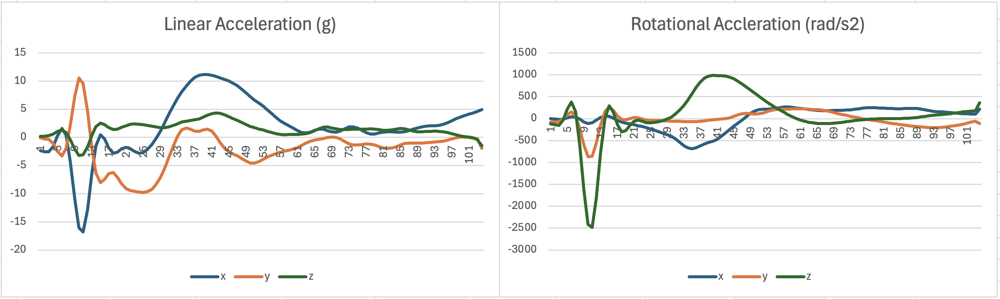

# Extension: Preparing the Mesh for LS-DYNA Simulation

## Overview

After image segmentation and mesh creation, the brain mesh creation pipeline produces a subject-specific finite element mesh in LS-DYNA keyword `.k` format.

Finite element simulation setup is outside the main scope of this repository. However, this page provides a brief demonstration of how the generated mesh can be prepared for downstream FE simulation after `04_MeshCreation.ipynb`.

This page briefly introduces material assignment, an example rugby head impact loading file, and how these files can be organised using LS-DYNA `*INCLUDE` statements.

---

## 1. Material assignment

The generated mesh preserves anatomical detail by assigning different LS-DYNA part numbers to the segmented brain and head structures.

For FE simulation, these parts need to be linked to material models. In the example files provided with this repository, the material and section definitions are stored in:

```text
src/dependencies/sim/material_properties.k
```

This file contains example LS-DYNA material definitions for the main tissue classes used by the model, including skin, grey matter, white matter, CSF, brainstem, skull, falx, tentorium, dura mater, and pia mater.

The anatomical part definitions and their assigned material IDs are stored in:

```text
data/subjects/sub0045/visualise/part_list_full.k
```

Each `*PART` card links an anatomical structure to a material ID (`mid`). For example:

```text
*PART
Left-Cerebral-Cortex
$#     pid     secid       mid     eosid      hgid      grav    adpopt      tmid
         3         1         4         0         4         0         0         0
```

Here, the left cerebral cortex has part ID `3` and is assigned material ID `4`.

A simplified summary of the material IDs used in the example setup is shown below.

| Material ID | Tissue class | Example parts |
|---|---|---|
| `2` | Skull | `Skull` |
| `3` | CSF / ventricles | `CSF`, lateral ventricles, 3rd ventricle, 4th ventricle |
| `4` | Grey matter / deep grey matter | cortex, thalamus, caudate, putamen, hippocampus, amygdala |
| `5` | White matter | cerebral white matter, cerebellar white matter, corpus callosum |
| `6` | Brainstem | `Brain-Stem` |
| `7` | Skin | `Skin` |
| `12` | Falx / dura / tentorium | `Falx`, `Dura_Matter`, `Tentorium` |
| `15` | Pia mater | `Pia_Matter` |

Some deep brain structures are retained as separate anatomical parts but are assigned to broader tissue classes because region-specific experimental material data are not currently available for every structure. This means the anatomical segmentation is preserved, while the material assignment can still be updated in the future without regenerating the mesh.

> **Note:** The provided material property file is an example. Users should check and adapt material parameters before using the model for a new scientific or clinical application.

---

## 2. Example rugby head impact loading

An example rugby head impact loading file is provided in:

```text
src/dependencies/sim/acceleration_rugby1.k
```

This file demonstrates how head impact kinematics can be provided to the model. The example contains linear and rotational head kinematics from a rugby impact.

The acceleration curves are shown below.



_The figure shows linear acceleration in the x, y, and z directions, and rotational acceleration in the x, y, and z directions._

---

## 3. Example LS-DYNA _include_ structure

A master LS-DYNA keyword file can be used to organise the mesh, material definitions, part definitions, set definitions, and loading file.

For example, a demonstration master keyword file could be named `run_simulation.k`:

```text
*KEYWORD

$ -------------------------------------------------------------------------
$ Brain mesh
$ -------------------------------------------------------------------------
*INCLUDE
mesh_smoothed_revised.k

$ -------------------------------------------------------------------------
$ Material definitions
$ -------------------------------------------------------------------------
*INCLUDE
src/dependencies/sim/material_properties.k

$ -------------------------------------------------------------------------
$ Part and set definitions
$ -------------------------------------------------------------------------
*INCLUDE
data/subjects/sub0045/visualise/part_list_full.k
*INCLUDE
data/subjects/sub0045/visualise/set_list.k

$ -------------------------------------------------------------------------
$ Rugby head impact loading example
$ -------------------------------------------------------------------------
*INCLUDE
src/dependencies/sim/acceleration_rugby1.k

*END
```

In LS-DYNA keyword files, each `*INCLUDE` card points to one file. Therefore, the `*INCLUDE` keyword is repeated for each file being included.

This example is intended to show how the files can be organised. It is not provided as a complete runnable simulation input. The exact include paths should be adapted depending on where the subject-specific mesh and simulation files are stored.

For example, if the files are copied into a subject-specific simulation folder:

```text
data/subjects/<subject_name>/simulation/
├── run_simulation.k
├── mesh_smoothed_revised.k
├── material_properties.k
├── part_list_full.k
├── set_list.k
└── acceleration_rugby1.k
```

> **Note:** This repository the anatomical mesh and provides example material and loading keyword files. It does not provide a complete FE simulation setup. Users who wish to run simulations should define any additional solver settings and simulation controls according to their own modelling requirements.

---

## 4. Example simulation output

The following animation shows an example simulation output, change of maximum principal strain, visualised in LS-PrePost.


This example shows how the generated brain mesh can be used in downstream FE simulations. The simulation setup, loading condition, solver settings, and post-processing choices should be selected according to the scientific question being studied.

---

## 5. Application in traumatic brain injury and iNPH research

The brain mesh creation pipeline provides the anatomical basis for subject-specific finite element head models. Although the demo mesh generated in this repository is not independently validated as a new model, models generated using this modelling framework have been evaluated and applied in previous studies.

In traumatic brain injury research, model predictions of brain displacement have been compared with controlled cadaveric impact experiments. Across multiple rapid head rotation cases, these models achieved an average CORA score of 0.60 when compared with experimentally measured brain motion (Alshareef et al., 2018, 2020; Duckworth et al., 2022).

The models have also been used to investigate tissue-level deformation during head impacts. Previous studies reported that predicted regions of high strain and strain rate overlapped with locations associated with chronic traumatic encephalopathy pathology and microbleeds (Ghajari et al., 2017; Duckworth et al., 2022). Further work used model-predicted strain rate patterns to provide a biomechanical explanation for loss of consciousness following head impact (Zimmerman et al., 2023).

Beyond traumatic brain injury, models generated using this pipeline have also been applied to idiopathic normal pressure hydrocephalus (iNPH). In this context, the model was used to simulate the complex morphological changes associated with ventricular enlargement and brain deformation. The simulated morphology reproduced diagnostic imaging biomarkers with high accuracy, including the callosal angle and z-Evans index, with deviations of 0.7% and 1.8%, respectively. The model also predicted tissue damage locations that were consistent with MRI observations in patients with iNPH (Darvishi et al., 2025; Del Giovane et al., 2026).

Together, these studies show that subject-specific finite element models generated using the brain mesh creation pipeline can support biomechanical investigations across different neurological conditions, including traumatic brain injury and iNPH.

---

## References

- Alshareef A, Giudice JS, Forman J, et al (2020) Biomechanics of the human brain during dynamic rotation of the head. J Neurotrauma 37:1546–1555
- Alshareef A, Giudice JS, Forman J, et al (2018) A novel method for quantifying human in situ whole brain deformation under rotational loading using sonomicrometry. J Neurotrauma 35:780–789
- Duckworth H, Azor A, Wischmann N, et al (2022) A finite element model of cerebral vascular injury for predicting microbleeds location. Front Bioeng Biotechnol 10:860112
- Darvishi V, Del Giovane M, David MCB, et al (2025) Towards a Deeper Understanding of Axonal Injury Mechanisms Using a Novel Biomechanical Model of Normal Pressure Hydrocephalus. Injury Biomechanics Symposium
- Del Giovane M, Darvishi V, David MC, et al (2026) Modelling the effect of ventricular expansion on white matter in normal pressure hydrocephalus. Under revision at Brain
- Ghajari M, Hellyer PJ, Sharp DJ (2017) Computational modelling of traumatic brain injury predicts the location of chronic traumatic encephalopathy pathology. Brain 140:333–343
- Zimmerman KA, Cournoyer J, Lai H, et al (2023) The biomechanical signature of loss of consciousness: computational modelling of elite athlete head injuries. Brain 146:3063–3078