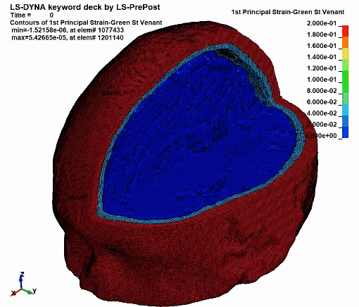

# PARS: Pipeline for Automated Reconstruction of Subject-specific head models

PARS is an automated pipeline for generating subject-specific finite-element head models from structural MRI data. It takes MRI-derived inputs, prepares a labelled whole-head geometry, and converts that geometry into an LS-DYNA finite-element mesh.

<p align="center">
  
</p>

*A PARS-generated head model used in a finite-element simulation to estimate brain-tissue deformation.*

If you use PARS, please cite:

> Darvishi V., Chan E. Y. K., Duckworth H., Parker T. D., Sharp D. J., Ghajari M. PARS: an automated, open-source pipeline for subject-specific finite element head modelling from MRI. *bioRxiv* 2026.07.05.736584 (2026). https://doi.org/10.64898/2026.07.05.736584

## How to use these docs

PARS has two setup routes, but only one workflow.

First, choose where you want to run PARS:

| Setup route | What it is for |
|---|---|
| [Local setup](installation.md) | Run PARS on your own computer, workstation, or institutional machine. |
| [GitHub Codespaces setup](codespaces.md) | Run PARS in a browser-based Linux environment without installing PARS or its dependencies on your own device. |

After the environment is ready, follow one common workflow:

| Workflow page | What it explains |
|---|---|
| [Using PARS](usage.md) | Required input files, notebook settings, run order, mesh smoothing settings, and checks before simulation. |
| [Outputs](outputs.md) | Main files created by the image-processing and mesh-creation notebooks. |
| [Troubleshooting](troubleshooting.md) | Common setup, input, notebook, and mesh-smoothing errors. |

## Workflow overview

PARS is run through two Jupyter notebooks:

1. `notebooks/01_ImageProcess.ipynb` prepares the labelled whole-head geometry.
2. `notebooks/02_MeshCreation.ipynb` converts that labelled geometry into a finite-element mesh.

Users normally only need to:

1. set up the environment locally or in Codespaces;
2. place the required subject files in the expected folder;
3. change the subject name and a few settings at the start of each notebook;
4. run the notebook cells in order; and
5. inspect the generated image and mesh outputs before using them downstream.

## Repository structure

```text
PARS/
├── data/
│   └── subjects/               # subject inputs and generated outputs
├── docs/                       # documentation website source
├── notebooks/
│   ├── 01_ImageProcess.ipynb   # image-processing workflow
│   └── 02_MeshCreation.ipynb   # mesh-generation workflow
├── src/
│   ├── brain_mesh_creation/    # Python code used by the notebooks
│   └── dependencies/           # reference files
├── requirements.txt
└── pyproject.toml
```

## What PARS does

PARS supports:

- generation of subject-specific head geometry from MRI-derived inputs;
- creation of detailed finite-element head meshes;
- control of mesh size and mesh-smoothing settings;
- reconstruction of structures including the falx and tentorium; and
- preparation of models for finite-element simulation and brain-strain analysis.

## What PARS produces

The image-processing notebook creates:

```text
data/subjects/{subject_name}/pre_model.nii.gz
```

The mesh-creation notebook then writes mesh files under:

```text
data/subjects/{subject_name}/output/
```

The final revised mesh is normally:

```text
mesh_smoothed_revised.k
```

See [Outputs](outputs.md) for a concise description of the generated files.
